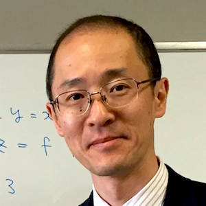

# Kenichi Asai / Delimited Continuations for Everyone

Have you thought of continuations as something that only program semanticists and compiler implementers are concerned with? In fact, the concept of continuations appears everywhere and is useful for everyone. In this talk, Kenichi will introduce [delimited continuations](https://en.wikipedia.org/wiki/Delimited_continuation) from the programmer's perspective directly without requiring any program transformation or semantic arguments. He will then show how various and seemingly complex programs can be written simply and concisely by manipulating delimited continuations. The goal here is to convince you that delimited continuations are useful in day-to-day programming. Finally, Kenichi will speculate on the [Curry-Howard isomorphism](http://disi.unitn.it/~bernardi/RSISE11/Papers/curry-howard.pdf) of delimited continuations, which could open the door for the introduction of delimited continuations into theorem proving.

**[VIDEO: Delimited Continuations for Everyone](https://youtu.be/QNM-njddhIw)**

### Referenced Papers

* [Representing Control: A Study of CPS transformation](https://www.cs.uoregon.edu/research/summerschool/summer09/lectures/danvy-filinski-mscs92.ps)
* [Abstracting Control](https://pdfs.semanticscholar.org/9c0b/89b500328aac8f8501c03166b291d740b4a7.pdf)
* [Functional Unparsing](http://www.brics.dk/RS/98/12/BRICS-RS-98-12.pdf)
* [The Theory and Practice of First-Class Prompts](http://www.cs.tufts.edu/~nr/cs257/archive/matthias-felleisen/prompts.pdf)
* [A Formulae-as-Types Notion of Control](https://pdfs.semanticscholar.org/3269/b62bc0ff84dc5fdcc6153094704b98799f67.pdf)
* [Cogen in Six Lines](http://citeseerx.ist.psu.edu/viewdoc/download?doi=10.1.1.51.7918&rep=rep1&type=pdf)
* [Representing Monads](http://citeseerx.ist.psu.edu/viewdoc/download?doi=10.1.1.43.8213&rep=rep1&type=pdf)
