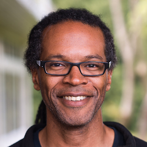

# Ronald Garcia / What type of thing is a type?

Types and type systems come up all the time when we talk about, learn, and use programming languages. Programmers have many useful intuitions about types, including what they are, what they have to offer, and how to think about and exploit them. Meanwhile, language theorists wrestle with these intuitions and work to make them even more precise: what in the world is a type? What is a type system? How can (and should) we formally reason about them?

In this talk, Ronald will unpack types and type systems from the perspectives of programming languages theorists, rather than practitioners. By spending quality time with some classic literature, we will see that formal theories about types and type systems have shifted back and forth and back again over time, depending on the challenges facing individual theorists, their conceptual stances, and the increasing sophistication and scope of types as part of language designs.

**[VIDEO: What type of thing is a type?](https://youtu.be/jVyz3lWH2bA)**

### Referenced Papers

* [Types Are Not Sets](http://www.cs.fsu.edu/~langley/COP4020/2016-Summer/p120-morris.pdf)
* [A Theory of Type Polymorphism in Programming](http://www.research.ed.ac.uk/portal/files/15143545/1_s2.0_0022000078900144_main.pdf)
* [Types, Abstraction, and Parametric Polymorphism](https://people.mpi-sws.org/~dreyer/tor/papers/reynolds.pdf)
* [Co-induction in Relational Semantics](http://www.lfcs.inf.ed.ac.uk/reports/88/ECS-LFCS-88-65/ECS-LFCS-88-65.pdf)
* [Typing First-class Continuations](https://www.cs.cmu.edu/~rwh/papers/callcc/popl91.pdf)
* [A Syntactic Approach to Type Soundness](https://www.cs.virginia.edu/~weimer/2008-615/reading/wright92syntactic.pdf)
* [Semantics of Types for Mutable State](http://www.ccs.neu.edu/home/amal/ahmedsthesis.pdf)
