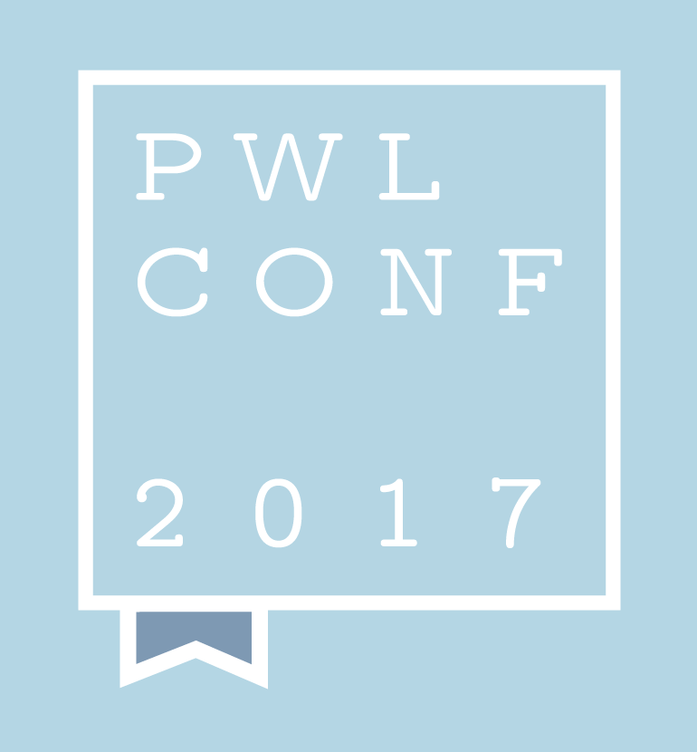

# PWLConf 2017

The second annual PWLConf took place on September 28, 2017 in St. Louis, MO, co-located with [Strange Loop](https://thestrangeloop.com). Each talk was recorded and captioned. We've assembled all of the available materials here as an archive. Each speaker has an entry in the repo which contains the abstract for their talk, the video, and slide decks if available.

### 2017 Speakers / Talks

- [**Kenichi Asai** / Delimited Continuations for Everyone](https://github.com/papers-we-love/pwlconf-info/tree/master/2017/kenich-asai)
- [**Elaine Chew** / Decoding the Sensuality in Music](https://github.com/papers-we-love/pwlconf-info/tree/master/2017/elaine-chew)
- [**James Long** / My History with Papers](https://github.com/papers-we-love/pwlconf-info/tree/master/2017/james-long)
- [**Ronald Garcia** / What type of thing is a type?](https://github.com/papers-we-love/pwlconf-info/tree/master/2017/ronald-garcia)
- [**Chas Emerick** / Programming data for display, the PDF Story](https://github.com/papers-we-love/pwlconf-info/tree/master/2017/chas-emerick)
- [**Fabienne Serrière** / Knittable Seashells](https://github.com/papers-we-love/pwlconf-info/tree/master/2017/fabienne-serrière)
- [**Heather Miller** / What happened to distributed programming languages?](https://github.com/papers-we-love/pwlconf-info/tree/master/2017/heather-miller)

### Papers We Love

If you want to be involved with a specific Papers We Love chapter or help within the larger community as a whole, please reach out to us at <a href="mailto:contact@paperswelove.org">contact@paperswelove.org</a>. And, don’t forget, we aggregate chapters’ events and spotlight videos at our website, <a href="http://paperswelove.org/">http://paperswelove.org/</a>, and you can always join us on <a href="http://papersweloveslack.herokuapp.com/">Slack</a>.

Finally, we’d love to see you at one of our meetups. Say hello and let us know how PWL can improve. Thank you for being a part of our community.
